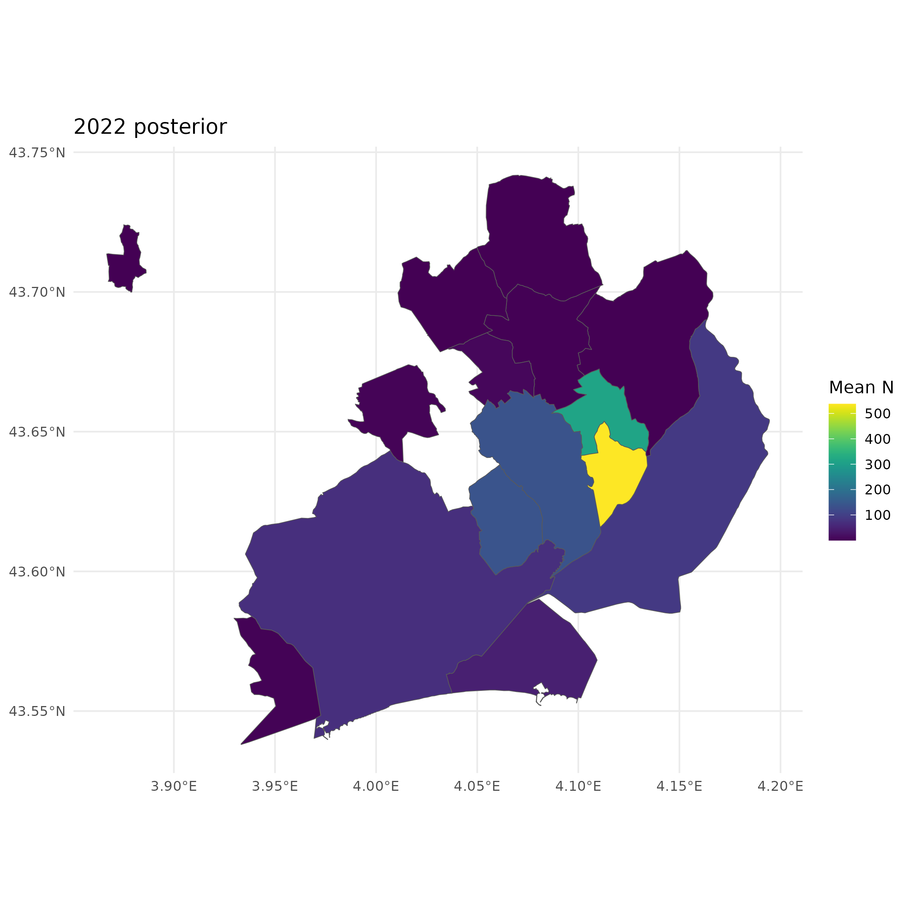
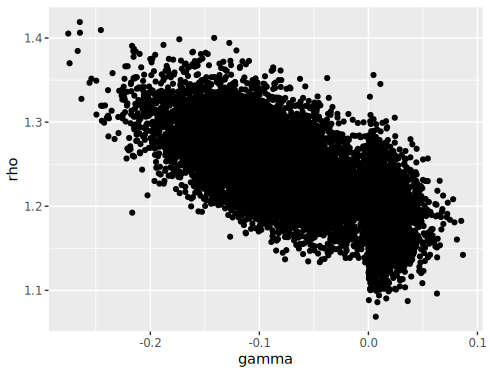
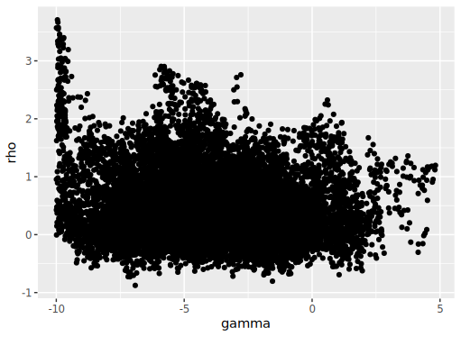
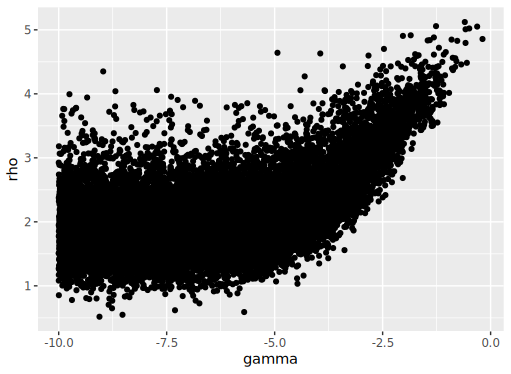

```{r, echo=FALSE, out.width="80%", fig.align="center"}

```

$$
R_{t-1,i} = N_{t-1, i} - n_{t-1,i}
$$
$$
A_{t-1,i} = \frac{1}{b_i}\sum_{j \in \textbf{B}_i} R_{t-1, j}
$$
$$
\text{log}(\lambda_{t,i}) = \beta X_{t,i} + \rho \text{log}(R_{t-1,i}) + \gamma \text{log}(A_{t-1,i}) + s_t
$$

```{r, echo=FALSE, out.width="80%", fig.align="center"}

```         
          
    
    
Idea 1:

$$
\text{log}(\lambda_{t,i}) = \beta X_{t,i} + \text{log}(e^\rho R_{t-1,i}) + \text{log}(e^\gamma A_{t-1,i}) + s_t
$$

```{r, echo=FALSE, out.width="80%", fig.align="center"}

```  

Idea 2:

$$
\text{log}(\lambda_{t,i}) = \beta X_{t,i} + \text{log}(e^\rho R_{t-1,i} + e^\gamma A_{t-1,i}) + s_t
$$

```{r, echo=FALSE, out.width="80%", fig.align="center"}

```   


